<div align="center">

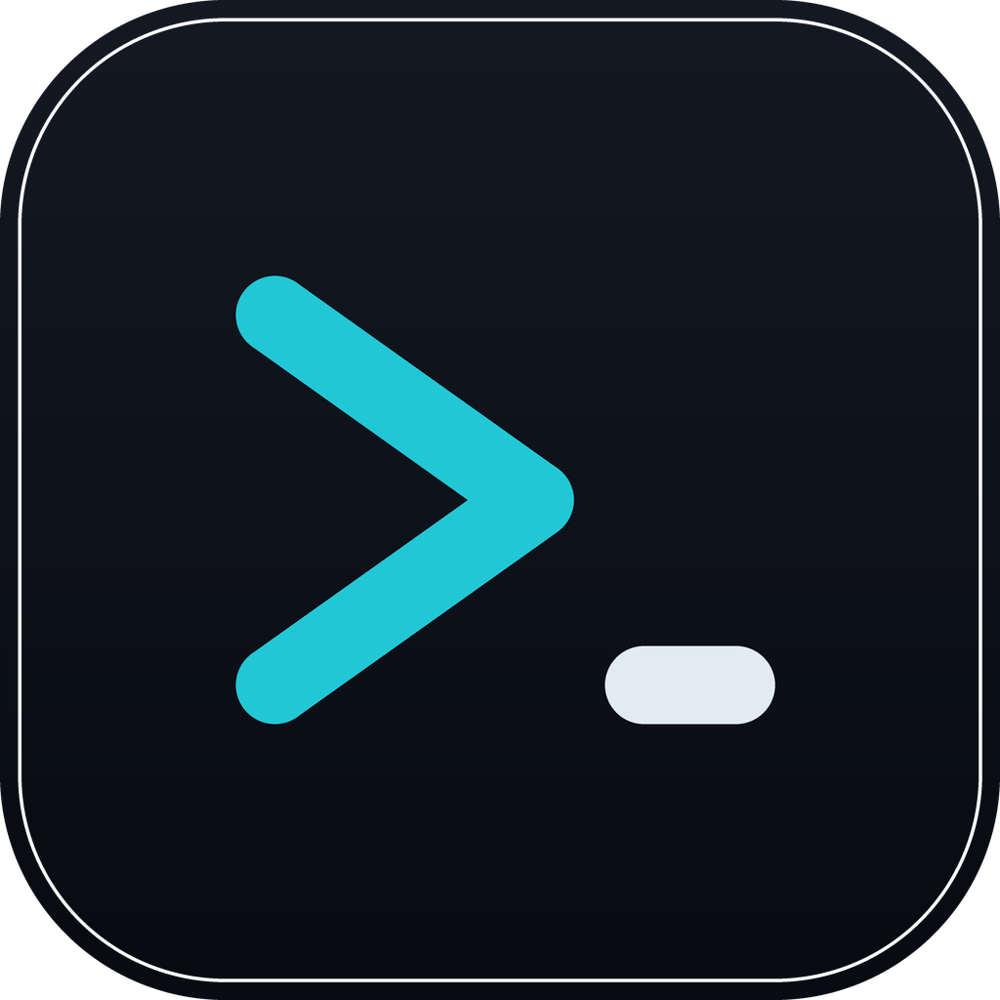

# ShellPilot

**A free, open-source SSH client, SFTP browser, database manager, secrets vault and secure AI-agent gateway — in one desktop app.**

Your DevOps workstation, everywhere. Windows · macOS · Linux.

<a href="https://github.com/ghauri01/ShellPilot/releases/latest">

</a>

<a href="https://github.com/ghauri01/ShellPilot/releases/latest"></a>
<a href="https://github.com/ghauri01/ShellPilot/releases/latest"></a>
<a href="https://github.com/ghauri01/ShellPilot/releases/latest"></a>

[](https://github.com/ghauri01/ShellPilot/releases/latest)
[](https://github.com/ghauri01/ShellPilot/releases)
[](https://github.com/ghauri01/ShellPilot/stargazers)
[](LICENSE)

[Features](#features) · [AI Agent Access](#ai-agent-access) · [Install](#install) · [Quick start](#quick-start) · [Comparison](#shellpilot-vs-mobaxterm-putty-termius-and-securecrt) · [Workspaces](#workspaces) · [Local terminal](#local-terminal) · [Command palette](#command-palette) · [Shortcuts](#keyboard-shortcuts) · [Databases](#databases) · [Vault](#vault) · [Use cases](#real-world-use-cases) · [FAQ](#faq) · [Contributing](#contributing) · [Licence](#licence)

</div>

---

> [!CAUTION]
> **Windows and macOS will show a security warning the first time you run ShellPilot.
> This is expected, and it is not a virus.**
>
> The app is **not notarized**, and on Windows not signed at all — a code-signing
> certificate costs $200–$400 a year for Windows and $99 a year for Apple, which a free
> MIT-licensed project has no income to cover. The warning means your operating system
> cannot confirm **who published** the app. It says nothing about whether the file is safe.
>
> Every release is **scanned by 70+ antivirus engines** and publishes a **SHA-256** for
> each file, so you can verify the download yourself.
> → [How to get past the warning, and the scan results](#first-run-why-your-computer-shows-a-warning)

ShellPilot is a **free and open-source alternative to MobaXterm, PuTTY, Termius, SecureCRT and MobaXterm Personal Edition**, built for engineers who spend the day moving between bastions, production boxes and databases — and increasingly, for the AI coding agents helping them do it. It combines an **SSH terminal**, **SFTP file browser**, **server monitoring**, **SSH tunnels**, a **multi-engine database client**, an **encrypted password vault** and a **secure [MCP](#ai-agent-access) bridge for Claude Code, Claude Desktop, Codex and other AI agents** in a single window — with no account, no telemetry and no subscription.

**What makes it different** isn't any one of those — MobaXterm, Termius and the rest each do some of this. It's that they're all in the same place, sharing the same credential store, and that credential store is now also what stands *between* an AI agent and your infrastructure, not something an agent ever has to be handed directly.

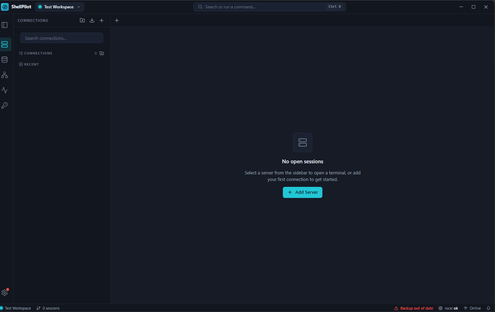

## Why ShellPilot

Most terminal tools do one thing. A typical DevOps task needs four: open a shell through a jump host, tail a file, poke a database that is only reachable from inside the network, and look up a credential. ShellPilot puts those in one place, keeps them organised per project, and stores every secret in your operating system's keychain rather than a plaintext config file.

- **No lock-in** — connections import from your existing `~/.ssh/config`
- **No account** — nothing is uploaded, nothing phones home
- **No cost** — MIT licensed, free forever, contributions welcome
- **No exposed credentials, even to AI** — Claude Code, Claude Desktop and Codex can run commands and read files through it, but never see a password, private key, IP or username — see [AI Agent Access](#ai-agent-access)

## ShellPilot vs MobaXterm, PuTTY, Termius and SecureCRT

If you are looking for a **free MobaXterm alternative**, a **modern PuTTY replacement**, or an
**open-source Termius alternative** that does not put your saved servers behind a subscription,
this is the short version:

| | **ShellPilot** | MobaXterm | PuTTY | Termius | SecureCRT |
|---|---|---|---|---|---|
| Price | **Free, MIT** | Free tier, paid Pro | Free | Free tier, paid Pro | Paid licence |
| Open source | **Yes** | No | Yes | No | No |
| Windows / macOS / Linux | **All three** | Windows only | All three | All three | All three |
| Account required | **No** | No | No | Yes for sync | No |
| Telemetry | **None** | Some | None | Yes | Some |
| Saved sessions limit | **Unlimited** | 12 on free tier | Unlimited | Limited on free tier | Unlimited |
| Chained jump hosts | **Unlimited** | Yes | Manual | Yes | Yes |
| SFTP browser | **Built in** | Built in | Separate app | Built in | Built in |
| SSH tunnels + SOCKS5 | **Yes** | Yes | Yes | Yes | Yes |
| Database client | **PostgreSQL, MySQL, SQL Server, MongoDB, Redis** | No | No | No | No |
| Encrypted secrets vault | **Yes, AES-256-GCM** | Password store | No | Cloud vault | No |
| Live server monitoring | **Yes** | Basic | No | No | No |
| Rebindable shortcuts | **Every one** | Partial | Partial | Partial | Yes |
| AI agent integration (MCP) | **Yes, access-group scoped** | No | No | No | No |

The point of difference is the **database client and the vault**. Every other tool in that table
sends you to a second application the moment you need to query a table or look up an API key.


## Features

| | |
|---|---|
| **SSH terminal** | Full xterm terminal with GPU rendering, search, split panes, copy-on-select and configurable zoom |
| **Local terminal** | Your own zsh, bash, PowerShell, Git Bash, MSYS2 or WSL in a tab beside the SSH ones — discovered per platform, a login shell on macOS, and reachable by no AI agent |
| **Jump hosts / bastions** | Unlimited chained hops per server, each with its own credentials |
| **Two-factor auth** | Answers keyboard-interactive challenges; connections are shared so you enter a code once, not per session |
| **SFTP browser** | Browse, edit, upload, rename and delete files over the same connection |
| **Server monitoring** | Live CPU, memory, disk and network docked under the terminal, with alerts on CPU, memory and failed systemd units |
| **Background checking** | Sample every server on a schedule, so a server that runs hot or a unit that dies at 3am is noticed while you are looking at something else |
| **Webhook alerts** | POST alerts to Slack, Discord, Teams or any HTTPS endpoint — friendly server name and what fired, never a hostname, an IP or a log line |
| **SSH tunnels** | Local forwards, remote forwards and a SOCKS5 proxy |
| **WireGuard** | Userspace WireGuard with **no administrator rights** — the tunnel appears as a local SOCKS5 proxy and forwards, and your routing table is never touched |
| **OpenVPN** | Bundled on macOS and Linux, driven over its management interface, with one-time codes and split tunnelling |
| **frp** | Publish a local port through an frp server, with a per-proxy confirmation naming exactly what becomes reachable |
| **SSH & databases over VPN** | Point a server or a database at a VPN profile and it is brought up, waited for, and torn down with the session |
| **Databases** | PostgreSQL, MySQL, SQL Server, MongoDB and Redis — with an interactive shell per engine |
| **Databases over SSH** | Reach a database that is only routable from a bastion |
| **Vault** | AES-256-GCM encrypted store for URLs, logins, API keys and free-form key/value pairs |
| **Workspaces** | Isolated, optionally password-protected spaces per client or environment |
| **Encrypted backup** | One passphrase-protected file containing everything, portable across machines |
| **Host key verification** | Trust-on-first-use, with a hard stop when a key changes |
| **Rebindable shortcuts** | Every shortcut is remappable per context, with conflict detection and export/import |
| **AI & MCP** | Let Claude Code, Claude Desktop, Codex and other MCP clients operate your servers — scoped by access group, with human approval on sensitive actions |

Fleet operations — <kbd>Ctrl</kbd>+<kbd>M</kbd>, and each one **off until you turn it on**:

| | |
|---|---|
| **Inventory** | Every server, its OS and version, what it has pending, and when it was last seen |
| **Patching** | What is pending per server, applied in waves that stop on the first server that comes back unhealthy rather than rolling on |
| **Run one command everywhere** | Broadcast across selected servers with a confirmation naming exactly what runs where, per-server results, and a job that survives the app being closed |
| **Log tailing** | Follow a file across many servers at once, in one pane |
| **Fleet search** | Search across what has already been collected, without touching a server |
| **Docker** | Containers, images and volumes with honest per-item sizes, and reclaim by id against exactly what the preview showed — never a blind `prune` |
| **Compose** | Read a project's services, their state and their drift from the file on disk |
| **Kubernetes** | Workloads, cordon, drain and exec — drain refuses seven ways and treats a read that did not answer as a refusal in itself |
| **Databases, operated** | Replication lag, slow queries, table sizes and connection counts for PostgreSQL, MySQL/MariaDB, MongoDB and Redis |
| **Backups** | Scheduled dumps to a local path or S3-compatible storage, with restore **verified by restoring**, not by checking a file exists |
| **Security posture** | SSH config, sudo rules, listening ports and firewall state as they actually are on the server |
| **Firewall rules** | The rules themselves rather than a count of them — off by default, behind its own consent, never stored, and unreadable by an agent at any setting |
| **Configuration drift** | What changed on a server since the last time you looked |
| **Capacity trends** | Where disk and memory are heading, from history already collected |
| **Rules** | "When this fires, run that" — with the run needing the same approval it would need by hand |
| **Cron** | Read and edit crontabs, planned against the server and written through approval |
| **Runbooks** | On an alert, what was run the last three times it fired on that server |
| **Change log** | Who approved what, when, and what it did |
| **Access & keys** | Which key opens which server, and whose it is |
| **Supervised processes** | Keep local processes running, with nothing auto-starting: what survives a restart is the list, not a running command |

## AI Agent Access

Claude Code, Claude Desktop, Codex, Gemini CLI and anything else that speaks
[MCP](https://modelcontextprotocol.io) can list your servers, run commands, browse/edit files and
check metrics through ShellPilot. The agent asks for a server by its friendly name; ShellPilot
resolves the real connection, enforces per-capability policy, and can stop and ask you before
anything sensitive runs.

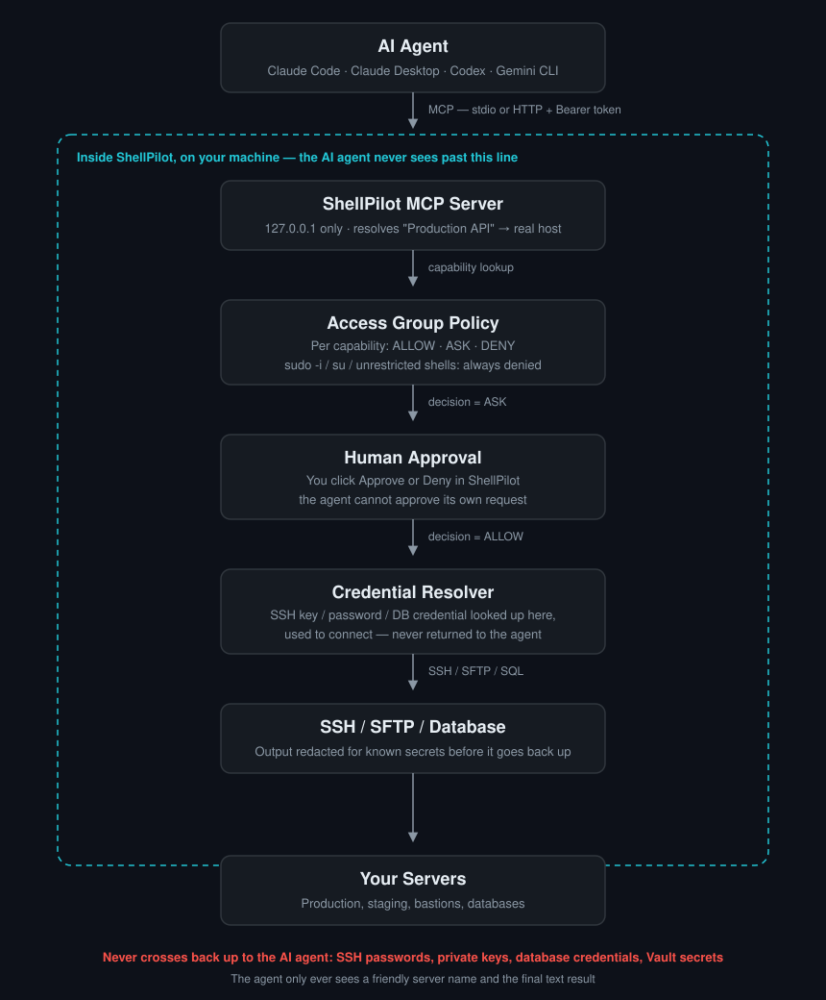

**An AI agent connected through ShellPilot never receives:**

- SSH passwords
- SSH private keys or passphrases
- Database passwords or connection-string credentials
- Vault secrets — there is no MCP tool that can read the Vault at all
- Sudo or root access — unrestricted shells (`sudo -i`, `su`, ...) are refused outright, for every access group, with no setting that turns it back on

It only ever gets a friendly server name, whatever a capability's ALLOW/ASK/DENY setting permits,
and redacted text output. See [AI-SECURITY.md](docs/AI-SECURITY.md) for the full threat model —
including what this design does **not** claim.

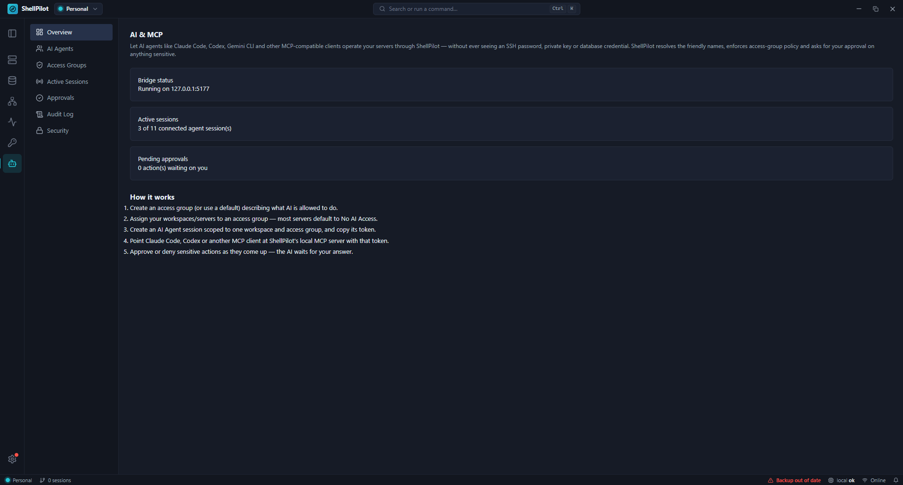

The **never receives** list above is enforced by an **access group** — a per-capability
ALLOW/ASK/DENY policy, not a single yes/no switch. Four built-in groups ship with ShellPilot
(Read Only, Read & Write, Sudo Access, Full Access); create as many custom ones as you want, and
override individual file paths on top of the blanket read/write setting:

<p align="center">
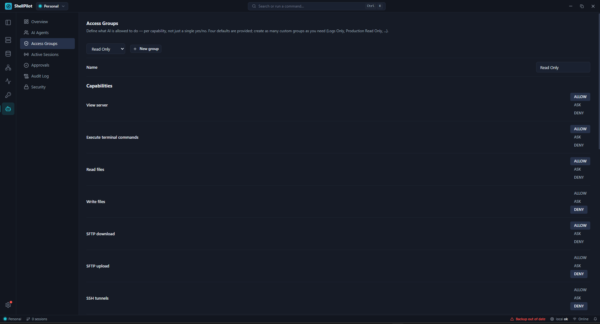
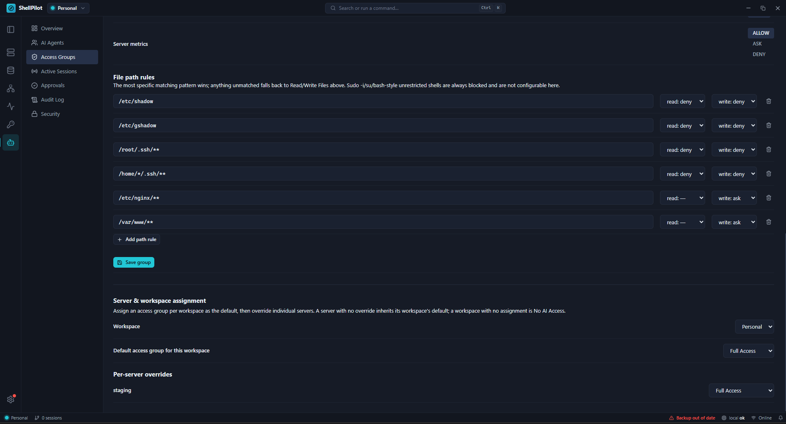
</p>

### A worked example

**You ask Claude Code:** *"Check my production Nginx server."*

1. Claude Code calls ShellPilot's `list_servers` tool. It gets back friendly names for whatever
   the session's workspace(s) and access group can see — say, `Nginx Server Prod` — never a hostname,
   IP or username.
2. It calls `get_server_metrics` (or `execute_command` with something like `systemctl status
   nginx`) naming that server. ShellPilot resolves `"Nginx Server Prod"` to the real server record,
   checks the access group governing it, and — if that capability is ALLOW — looks up the actual
   SSH credential from your OS keychain and connects. If it's ASK, the request sits in
   **Approvals** until you decide.
3. The command runs over a normal SSH connection, the same one an interactive terminal session
   would use. Output is scanned for known secrets and secret-shaped patterns and redacted before
   it's returned.
4. Claude Code sees the result — CPU, memory, `systemctl` output, whatever was asked for — and
   reports back to you. It never saw the server's IP, its username, or the key that authenticated
   the connection. The whole exchange is in the **Audit Log**, alongside anything else ShellPilot
   allowed, asked about, denied or failed:

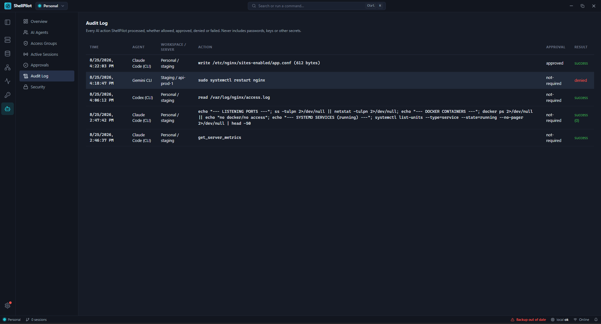

### Connecting an agent

The quickest route is **AI & MCP → Overview → Connect an agent**. One click turns on the bridge,
gives any unassigned workspace an access group, creates a session, and hands it to the client:

| Button | What it does |
|---|---|
| **Connect Claude Code** | Copies a ready `claude mcp add` command, token already in it — paste it in a terminal |
| **Connect Claude Desktop** | Writes the bridge entry into `claude_desktop_config.json`, merging with whatever is already there |
| **Connect Codex** | Writes a managed `[mcp_servers.shellpilot]` block into `~/.codex/config.toml` |

Existing config files are backed up first, other MCP servers in them are left alone, and running a
button again replaces its own entry rather than adding a second one. A workspace you have already
assigned to an access group — including **No AI Access** — is never reassigned.

There is also a CLI, if you would rather not click:

| Command | What it does |
|---|---|
| `shellpilot claude` | Registers ShellPilot with Claude Code (`claude mcp add`) and launches it — a one-time pairing code appears in ShellPilot instead of copying a token by hand |
| `shellpilot codex` | Same, for Codex — writes a managed block into `~/.codex/config.toml` |
| `shellpilot run -- <command>` | Same pairing flow for any other MCP-aware CLI, via `SHELLPILOT_MCP_COMMAND`/`SHELLPILOT_MCP_ARGS` |

> On macOS the `shellpilot` command is not added to your `PATH` by the installer — only the Windows
> installer does that. Use the Connect buttons, or call the launcher inside the app bundle directly.

Every other client connects over **Streamable HTTP** with a URL and a bearer token that
ShellPilot's own **Security** tab generates for you:

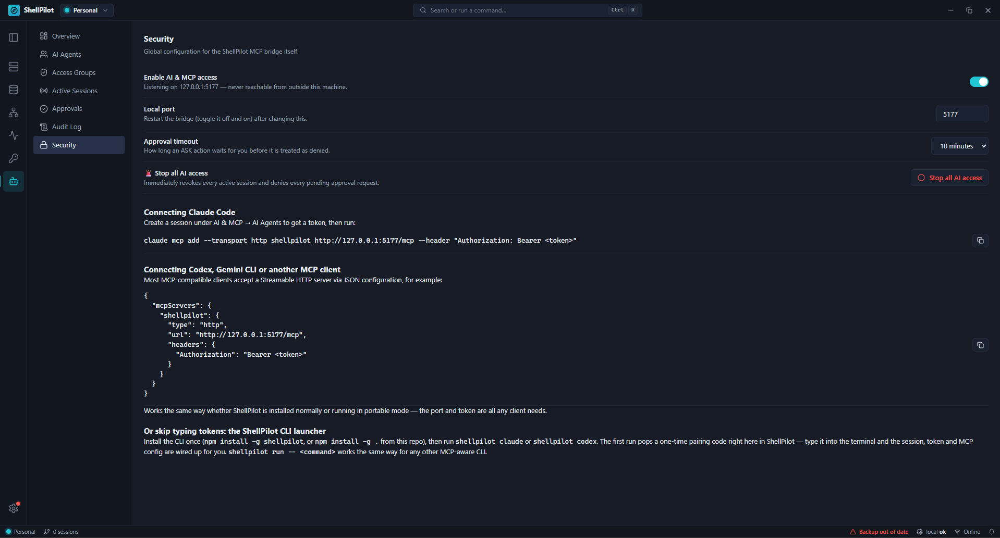

**Claude Desktop is the exception** — it cannot use that URL. See
[Connecting Claude Desktop](#connecting-claude-desktop) below.

### Adding a token manually

Not every client has a one-command launcher yet:

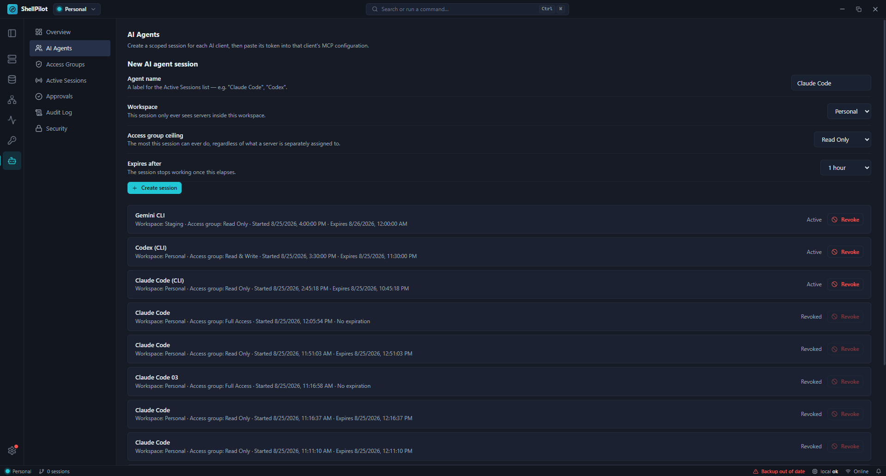

1. **AI & MCP → AI Agents → New AI agent session** — pick a workspace and an access-group
   ceiling, then **Create session**.
2. The token is shown **once**, next to a ready-made JSON block — click **Copy JSON config**, or
   copy the raw token if you'd rather write the entry yourself.
3. Paste it into the client's own MCP config file, under `mcpServers`.
4. Restart the client.

```json
{
  "mcpServers": {
    "shellpilot": {
      "type": "http",
      "url": "http://127.0.0.1:<port>/mcp",
      "headers": { "Authorization": "Bearer <token>" }
    }
  }
}
```

**Claude Code** needs no file editing at all — one command registers the same thing:

```bash
claude mcp add -s user --transport http shellpilot http://127.0.0.1:<port>/mcp --header "Authorization: Bearer <token>"
```

### Connecting Claude Desktop

Claude Desktop **does not read `url` or `headers`** from `claude_desktop_config.json`. Entries in
that file are launched as stdio subprocesses; Desktop's remote-server support is a separate
account-level Connectors feature with nowhere to put a bearer token for a `127.0.0.1` address.

ShellPilot ships a stdio bridge for exactly this case — a pure protocol relay that forwards
messages to the same authenticated HTTP endpoint, so a stdio-only client gets the identical
policy, approval and audit path (`src/cli/bridge.ts`). Point Desktop at it:

```json
{
  "mcpServers": {
    "shellpilot": {
      "command": "/Applications/ShellPilot.app/Contents/MacOS/ShellPilot",
      "args": [
        "/Applications/ShellPilot.app/Contents/Resources/app.asar.unpacked/out/cli/index.js",
        "bridge", "--token", "<token>", "--port", "<port>"
      ],
      "env": { "ELECTRON_RUN_AS_NODE": "1" }
    }
  }
}
```

On **Windows**, the two paths become `%LOCALAPPDATA%\Programs\ShellPilot\ShellPilot.exe` and
`%LOCALAPPDATA%\Programs\ShellPilot\resources\app.asar.unpacked\out\cli\index.js`.

The config file lives at `~/Library/Application Support/Claude/claude_desktop_config.json` on
macOS and `%APPDATA%\Claude\claude_desktop_config.json` on Windows. Restart Desktop afterwards.

`ELECTRON_RUN_AS_NODE` makes ShellPilot's own bundled Electron binary run the bridge as plain
Node, so nothing has to be installed separately and none of this depends on what is on your
`PATH` — which Claude Desktop does not inherit from your shell.

> **Give the Desktop session no expiry.** Set **Expires** to *Never* when creating it. The
> default is 60 minutes, after which Desktop silently stops being able to reach ShellPilot until
> you issue a new token.

The token is shown only once and stored only as a hash — if you lose it, revoke that session
under **Active Sessions** and create a new one rather than hunting for it:

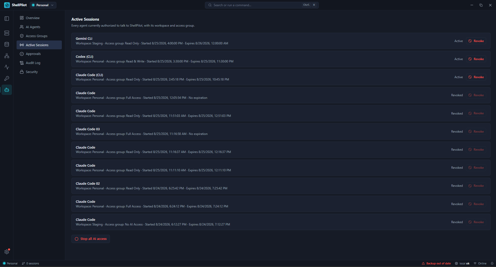

**Full technical guide (architecture, sessions, Access Groups, pairing, troubleshooting):**
[docs/AI-MCP.md](docs/AI-MCP.md). **Threat model:** [docs/AI-SECURITY.md](docs/AI-SECURITY.md).

## Real-world use cases

- **Production troubleshooting** — ask an agent to check a service's status, tail a log, or sample
  CPU/memory on a server named in plain English, without ever handing it that server's key.
- **Bastion / jump-server operations** — the same friendly-name resolution works through chained
  hops; an agent scoped to a workspace behind a bastion never needs the bastion's credential
  either.
- **Database investigation** — an agent with `databaseAccess` allowed can query a database that is
  only reachable through an SSH tunnel, the same way a human session would reach it.
- **Log investigation** — a `Read Only` or purpose-built "Logs Only" access group lets an agent
  search and summarise logs across a fleet without any path to modify anything.
- **Controlled production changes** — set the capability that matters to ASK; a config edit or a
  restart waits for your explicit approval instead of running unattended.
- **AI-assisted DevOps generally** — the same terminal, SFTP, database and monitoring tools you use
  by hand are available to an agent, scoped by workspace and access group exactly like a second,
  more limited pair of hands.

## Install

Download the latest build from the [Releases](https://github.com/ghauri01/ShellPilot/releases/latest) page.

| Platform | File | Notes |
|---|---|---|
| **Windows 10/11** | [`ShellPilot-x.y.z-setup.exe`](https://github.com/ghauri01/ShellPilot/releases/latest) | Installer, desktop + Start-menu shortcut. Pick this one if unsure. |
| **Windows (portable)** | [`ShellPilot-x.y.z-portable.exe`](https://github.com/ghauri01/ShellPilot/releases/latest) | Single file, no install, keeps its data beside the `.exe` — runs from a USB stick |
| **macOS (Apple Silicon)** | [`ShellPilot-x.y.z-arm64.dmg`](https://github.com/ghauri01/ShellPilot/releases/latest) | M1 and later |
| **macOS (Intel)** | [`ShellPilot-x.y.z-x64.dmg`](https://github.com/ghauri01/ShellPilot/releases/latest) | Intel Macs |
| **Linux** | [`ShellPilot-x.y.z-x86_64.AppImage`](https://github.com/ghauri01/ShellPilot/releases/latest) | `chmod +x ShellPilot-*.AppImage` and run — works on any distribution |
| **Linux (Debian / Ubuntu)** | [`ShellPilot-x.y.z-amd64.deb`](https://github.com/ghauri01/ShellPilot/releases/latest) | `sudo apt install ./ShellPilot-*-amd64.deb` |

<details>
<summary><b>What are the other files on the release page?</b></summary>

Six of the assets on a release are the downloads above. The rest are build
metadata or source archives, and you can ignore them.

| Asset | What it is | Do you need it? |
|---|---|---|
| `*.blockmap` | A map of the installer's content blocks, used to work out which parts of a file changed between two versions so an update can download only the difference. | **No** — it is only read by an updater, never by you. |
| **Source code** (zip / tar.gz) | A snapshot of the repository at the tagged commit, generated by GitHub. Not a build — it contains no application, just the source. | **No**, unless you intend to [build from source](#build-from-source). |

</details>

### First run: why your computer shows a warning

**ShellPilot is not notarized**, so the first time you run it you will see a security
warning. Nothing is wrong with the download; the warning is about a missing certificate,
not about the app.

Windows and macOS both expect an application to be signed with a **code-signing
certificate** — an identity certificate bought from a certificate authority, currently
around **$200–$400 a year** for Windows (or roughly **$99/year** for an Apple Developer
account on macOS). ShellPilot is free and MIT licensed with no income behind it, so that
certificate does not exist yet. Every unsigned app gets the same treatment, whoever wrote
it.

The macOS builds are **ad-hoc signed** — a signature that seals the bundle's contents but
carries no identity, so macOS can still tell you the app has not been tampered with since
it was built. What it cannot do is tell you who built it, which is what notarization is
for. The Windows builds carry no signature at all.

**The warning does not mean the file is unsafe.** It means the operating system cannot
confirm *who* published it. You can confirm that yourself — see
[Verifying a download](#verifying-a-download) below, and the entire source is public.

<details>
<summary><b>Windows — "Windows protected your PC"</b></summary>

SmartScreen shows a blue dialog saying *"Windows protected your PC"* and the **Run**
button is hidden.

1. Click **More info**
2. Click **Run anyway**

You may also see a "publisher unknown" prompt from User Account Control — that is the
same missing-certificate cause. This happens on the first run only.

</details>

<details>
<summary><b>macOS — "Apple could not verify ShellPilot is free of malware"</b></summary>

Gatekeeper refuses to open the app, because the build has not been notarized — Apple has
not been asked to scan it, which requires the paid developer account above. The wording
varies a little between macOS versions; older ones say *"cannot be opened because the
developer cannot be verified"*.

- **macOS 15 Sequoia and later** — open **System Settings → Privacy & Security**, scroll
  down to the message naming ShellPilot, and click **Open Anyway**. Sequoia removed the
  older right-click shortcut, so this is the only way through in the interface.
- **macOS 14 and earlier** — **right-click** (or Control-click) the app → **Open** →
  **Open** in the dialog.

Either way this is the first launch only; afterwards the app opens normally.

If you would rather do it from the Terminal, this clears the quarantine flag macOS attaches
to anything downloaded through a browser:

```bash
/usr/bin/xattr -cr /Applications/ShellPilot.app
```

The `/usr/bin/` prefix is deliberate. If you have installed `xattr` through Homebrew or
`pip`, that copy comes earlier on your `PATH` and does not accept `-r` — it prints a usage
message and clears nothing, which looks exactly like the command having failed to help.

</details>

<details>
<summary><b>macOS — "ShellPilot is damaged and can't be opened" (releases 0.2.2 and earlier)</b></summary>

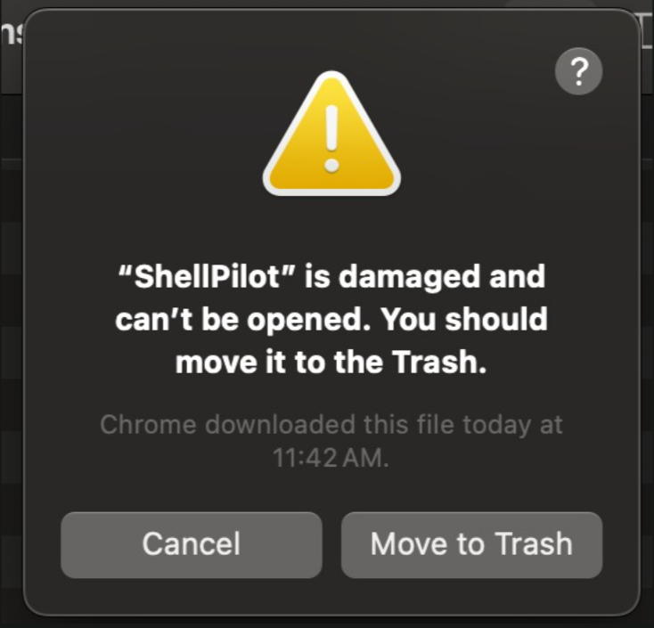

**The download is not damaged, and this is fixed in releases after 0.2.2.** Builds up to and
including 0.2.2 left the macOS app unsigned, which meant the bundle still carried the
signature Electron itself ships with — a signature covering none of ShellPilot's own files.
Gatekeeper reads that mismatch as a corrupted download and words it this way instead of the
ordinary "could not verify" message above. Unhelpfully, this particular dialog offers no
**Open Anyway** button, so there is nothing to click through.

If you want to satisfy yourself the file arrived intact before doing anything else, check the
release's SHA-256 against your download — see [Verifying a download](#verifying-a-download).

Do **not** move it to the Trash. Run this once instead:

```bash
/usr/bin/xattr -cr /Applications/ShellPilot.app
```

Then open the app normally. If it still refuses:

- Check the path is right — drag the app into the Terminal window after typing
  `/usr/bin/xattr -cr ` rather than typing it out.
- Make sure you are pointing at the copy in `/Applications`, not the one still sitting in
  `~/Downloads`.
- Keep the `/usr/bin/` prefix. A Homebrew or `pip` `xattr` earlier on your `PATH` does not
  support `-r` and will quietly do nothing but print its usage text.

Newer releases are ad-hoc signed, which puts them back into the ordinary "could not verify"
category above — still a warning, but one with a button.

</details>

<details>
<summary><b>Linux — no warning</b></summary>

Linux does not gatekeep unsigned binaries, so there is nothing to bypass. Just make the
AppImage executable:

```bash
chmod +x ShellPilot-*.AppImage
```

</details>

> **Will this be fixed?** Yes — signing and notarization are planned once the project can
> cover the annual certificate cost. Until then the macOS builds are ad-hoc signed so the
> warning is at least the ordinary, clickable kind, and the SHA-256 checksums on each
> release are the way to verify what you downloaded is what was built.

### Antivirus scan

Because the builds are unsigned, every release is scanned automatically as part of the
build, by three independent scanners, before anything is published:

| Scanner | What it is | Runs on |
|---|---|---|
| **Microsoft Defender** | The engine that ships with Windows — the same one that will scan the installer on your own machine | The Windows build runner, on the `.exe` files it just produced |
| **ClamAV** | The open-source engine, with signatures refreshed at build time | The Linux release job, across every artifact |
| **[VirusTotal](https://www.virustotal.com)** | Aggregates **70+ commercial engines** in one report | The release job, with a per-file report linked in the notes |

A detection from Defender or ClamAV **fails the build**, so a release that exists at all
has passed both. The results — and the VirusTotal links for each file — are printed in
every release's notes.

If you would rather check for yourself rather than trust a link in a README, you can:

- **Look the file up by its hash.** Every release lists a SHA-256 per asset. Paste it
  into [virustotal.com](https://www.virustotal.com) — searching by hash proves the report
  belongs to the exact bytes you downloaded, which a link alone does not.
- **Upload the file** to VirusTotal yourself.
- **Build from source.** The entire application is in this repository; see
  [Build from source](#build-from-source).

> **A note on false positives.** Unsigned Electron applications are flagged by one or two
> minor engines fairly often — an installer that unpacks an executable and opens network
> connections is, structurally, what a lot of malware also does. A handful of detections
> from engines you have never heard of, against a clean result from the major ones, is the
> normal picture for an unsigned open-source desktop app. Code signing is what removes it,
> and that is a cost problem rather than a technical one.

### Verifying a download

Every asset on the release page lists its SHA-256. Compare it against the file
you downloaded — the builds are unsigned, so this is the strongest integrity
check available:

```bash
sha256sum ShellPilot-x.y.z-x86_64.AppImage    # Linux
shasum -a 256 ShellPilot-x.y.z-arm64.dmg      # macOS
```

```powershell
Get-FileHash ShellPilot-x.y.z-setup.exe -Algorithm SHA256    # Windows
```

### Build from source

```bash
git clone https://github.com/ghauri01/ShellPilot.git
cd ShellPilot
npm install

npm run dev          # run in development
npm run typecheck    # type check main, preload and renderer
npm run build        # bundle without packaging

npm run dist:win     # Windows installer + portable exe
npm run dist:linux   # AppImage + deb
npm run dist:mac     # dmg (must be run on macOS)
```

Requires **Node.js 20+**. Build each platform's installer on that platform.

## Quick start

### 1. Add a server

Click **+** in the Connections sidebar, or press <kbd>Ctrl</kbd>+<kbd>N</kbd>.

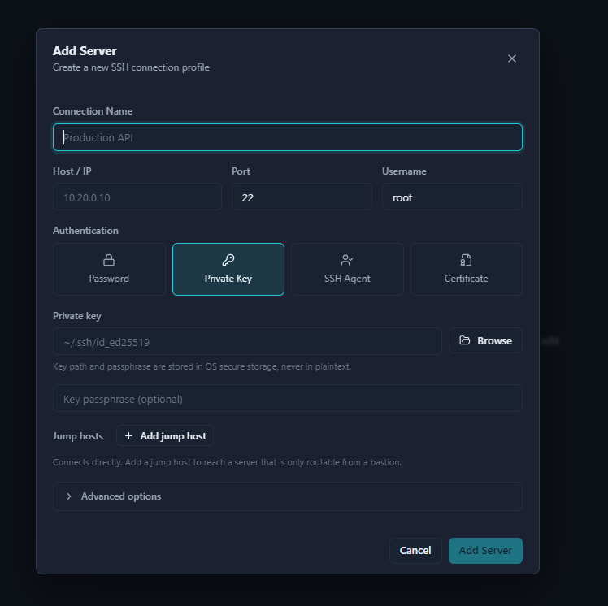

Fill in the server, port and username, then pick how to authenticate:

- **Password** — stored in your OS keychain
- **Private key** — browse to the key file; the path and optional passphrase are stored in the keychain, never in plaintext
- **SSH Agent** — uses `SSH_AUTH_SOCK`, or Pageant on Windows
- **Certificate** — for certificate-based setups

> **Key files without an extension** (`id_ed25519`, or any bare filename) are fully supported — the file picker shows all files by default.

### 2. Add jump hosts, in the same dialog

Servers inside a private network are reached through a bastion. Click **Add jump host** and the hops appear right there — no second dialog, no separate step.

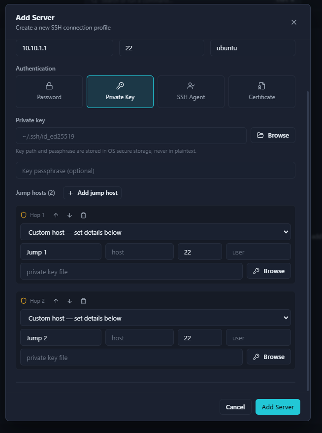

Each hop can either:

- **Use a saved server** — the hop borrows that server's stored credentials, so a key is defined once and reused, or
- **Be a custom server** — set its own server, port, user and private key

Hops connect in order, top to bottom: `you → Hop 1 → Hop 2 → target`. Use the arrows to reorder.

### 3. Open a session

Click a server to open it. **Double-click to open an additional session** in a new tab — useful when you want one shell tailing logs and another running commands.

Sessions keep running when you switch workspaces, change views or open a database. Nothing is torn down until you close the tab.

## Workspaces

A workspace is an isolated space with its own servers, folders, databases, tunnels and colour. Use one per client, per environment, or per project — whatever keeps unrelated infrastructure apart.

Open the switcher in the title bar, or **Manage Workspaces** (<kbd>Ctrl</kbd>+<kbd>Shift</kbd>+<kbd>N</kbd>).

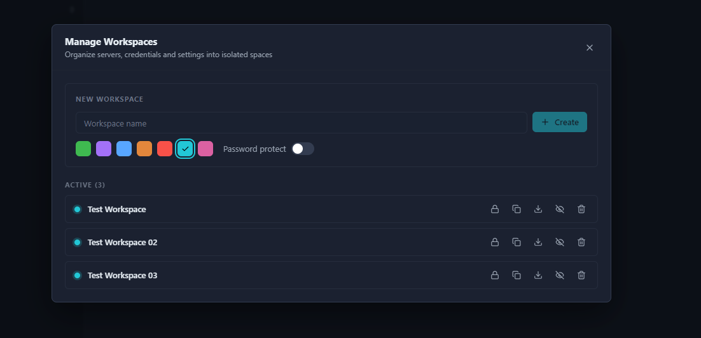

**What a workspace gives you**

- **Isolation** — the sidebar, tabs and databases only ever show the active workspace
- **Colour coding** — pick a colour so production never looks like staging
- **Fast switching** — <kbd>Ctrl</kbd>+<kbd>1</kbd> … <kbd>Ctrl</kbd>+<kbd>9</kbd> jump straight to a workspace
- **Hiding** — clutter you rarely touch can be hidden from the switcher
- **Password protection** — lock a workspace behind a password
- **Live sessions survive** — switching workspaces never disconnects a running session

**Password-protected workspaces**

Toggle **Password protect** when creating a workspace, or use the padlock on an existing one. Anything that tries to open it — the switcher, the shortcut, the manager — asks for the password first. Unlocks last for the session only; everything re-locks when the app restarts. The password is stored as a scrypt verifier, never as recoverable text.

> **Scope of this feature:** a workspace password gates access **inside the app**. It does not encrypt the workspace's servers on disk. For data that must be protected at rest, use the [Vault](#vault) or an [encrypted backup](#backup--restore).

## Organising servers with folders

Folders keep a long server list navigable, and they nest as deep as you like.

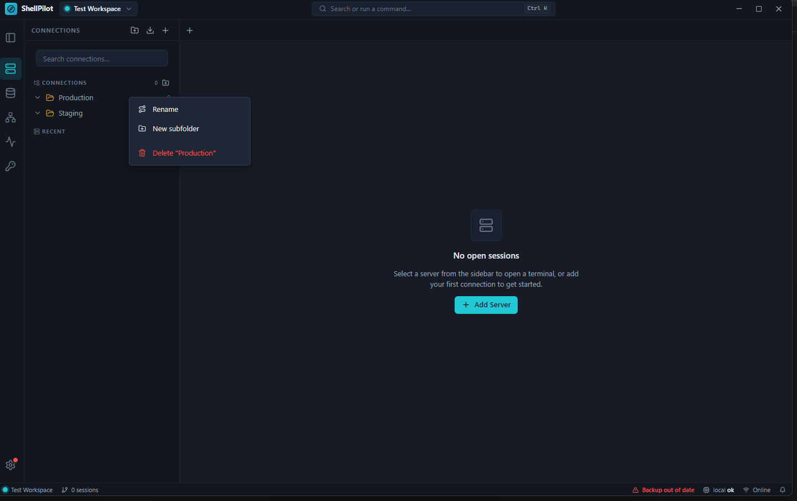

### Create a folder


The Connections toolbar has three actions — from left to right:

| Icon | Action |
|---|---|
| 📁+ | **New folder** — creates a folder and drops straight into rename |
| ⬇ | **Import from `~/.ssh/config`** — bulk-import your existing servers |
| ➕ | **Add server** |

There is also a small **New folder** button on the `CONNECTIONS` section header itself.

### Create a subfolder

**Right-click any folder** → **New subfolder**. The same menu has **Rename** and **Delete**.

Deleting a folder never deletes its contents — servers and subfolders move back to the top level.

### Move servers into folders

**Drag and drop.** Drag a server onto a folder to move it in; drag it onto the `CONNECTIONS` header to move it back to the root. Folders show a running count of everything inside them, including subfolders.

Databases have their own, separate folder tree with the same behaviour, so a "Staging" folder for servers does not clutter the database sidebar.

### Import from `~/.ssh/config`

Click the import icon to read your existing SSH config. ShellPilot parses `Host`, `HostName`, `User`, `Port`, `IdentityFile` and `ProxyJump`, applies `Host *` wildcard defaults the way OpenSSH does, and shows a preview so you choose what to import. `ProxyJump` entries become jump hosts automatically, carrying the referenced server's key.

## Terminal

| Action | Shortcut |
|---|---|
| Search the scrollback | <kbd>Ctrl</kbd>+<kbd>F</kbd> |
| Zoom in / out / reset | <kbd>Ctrl</kbd>+<kbd>+</kbd> / <kbd>Ctrl</kbd>+<kbd>-</kbd> / <kbd>Ctrl</kbd>+<kbd>0</kbd>, or <kbd>Ctrl</kbd>+scroll |
| Copy selection | Select (copy-on-select), or <kbd>Ctrl</kbd>+<kbd>Shift</kbd>+<kbd>C</kbd> |
| Paste | Right-click, or <kbd>Ctrl</kbd>+<kbd>Shift</kbd>+<kbd>V</kbd> |
| New session for this server | Double-click the server |
| Next / previous tab | <kbd>Ctrl</kbd>+<kbd>Tab</kbd> / <kbd>Ctrl</kbd>+<kbd>Shift</kbd>+<kbd>Tab</kbd> |
| Close tab | <kbd>Ctrl</kbd>+<kbd>W</kbd> |
| Command palette | <kbd>Ctrl</kbd>+<kbd>K</kbd> |

**Open files in your own editor.** In the Files view, right-click a remote file
and choose **Open in code** to edit it in VS Code (or whatever you configure in
Settings → Editor). Saving uploads it back to the server automatically — no
download/re-upload dance. The inline editor is still there for quick edits.

**Multi-line pastes ask first.** Pasting more than one line into a remote shell
shows a preview and a confirmation, because every line runs the moment it
lands. Single-line pastes go straight through.

Control keys such as <kbd>Ctrl</kbd>+<kbd>C</kbd>, <kbd>Ctrl</kbd>+<kbd>A</kbd> and <kbd>Ctrl</kbd>+<kbd>W</kbd> pass through to the remote shell, so `vim`, `nano` and bash line editing behave normally.

**Monitoring** is docked under the terminal rather than hidden in a separate tab. Expand it for live CPU, memory, disk and network. The strip samples only the tab you are looking at, and shares that session's SSH connection. Watching the servers you are *not* looking at is a separate feature — see [Checking servers in the background](#checking-servers-in-the-background).

### Alerts

When a server's CPU or memory reaches **80%** (configurable) you get a native OS
notification, repeated once a minute while it lasts and cleared automatically on
recovery. A count also appears in the status bar. A **systemd unit that has
failed** raises one too, on the transition into failure rather than every check,
so a service that has been down for a week does not re-announce itself.

A **root filesystem more than 85% full** raises one as well — the same 85% at
which the Fleet Monitor lists the server as needing attention and turns its disk
bar red, so the alert and the screen it sends you to can never disagree. The
status-bar count is that same figure and nothing else: clean a disk from 90% to
82% and the chip goes as soon as the next sample lands, because the Fleet
Monitor has stopped listing the server. It repeats **every six hours**, not every
minute: a disk does not empty itself, and a minute-long window is roughly ten
thousand notifications a week for one server that nobody can fix before Monday. It
does speak up sooner if the disk gets **5 percentage points worse** than the
figure it last reported, and again immediately if a disk that had recovered
fills a second time. Only `/` is measured — the probe is `df -kP /` and nothing
else, so a full `/var` on its own partition raises nothing here.

**Recovery has a margin, for CPU and memory only.** They clear five points below
the threshold rather than at it, so a server hovering on the line does not flicker
between alerting and clear on every two-second sample. Disk has no such gap: it
clears at 85% or below, the moment the Fleet Monitor stops flagging it.

**Turning alerts on or off.** Go to **Settings → Monitoring** and use the
**Alerts** toggle. It is the master switch: it is **on by default**, and
switching it off stops every CPU, memory, disk and failed-unit notification for
every server — and, because webhooks are sent from inside an alert, all webhook
delivery with them. **Switching it off also removes the alerts already showing**
in the status bar, and forgets the repeat windows behind them: a chip cannot
outlive the feature that raised it, and switching back on starts a clean slate
rather than resuming a six-hour disk window that began before the toggle. The
setting is global — it applies to all servers, not one at a time — and it persists
across restarts.

Under it, **Alert threshold** sets how hard a server has to be working before it
counts as high: **70%**, **80%** (default), **90%** or **95%**. The same
threshold applies to both CPU and RAM. Raise it if busy-but-healthy servers are
noisy, lower it if you want earlier warning. The threshold buttons are greyed
out while alerts are switched off. **Disk is not configurable**: it alerts above
**85%**, because that number is also what colours the bar and fills the Fleet
Monitor's attention list, and a slider that could pull one away from the other
would be a way to make the app contradict itself.

The last toggle in the section, **Show monitor under the terminal**, is
independent: it controls the live CPU/memory/disk/network strip docked below the
session, not whether you get alerted.

They are designed not to interrupt you:
- Notifications are handled by the operating system, so they render **outside
  the window and never cover the terminal**
- The status-bar chip sits in the layout, not floating over your output
- Nothing steals focus, and nothing must be dismissed before you carry on
- With the monitor open, alerts are evaluated from metrics **already being
  sampled**, so they add no extra SSH load. Background checking, below, is the
  part that costs something — that is the point of it being a separate switch

### Checking servers in the background

An alert is only worth having if it can reach you when you are not already
looking at the problem. **Settings → Monitoring → Check servers in the
background** samples **every server in the workspace** on a schedule, whether or
not a monitor is open, so a server that runs hot or a unit that dies at 3am is
noticed rather than discovered later.

It is off by default, because it is not free: each pass opens **one SSH exec
channel per server**, separately from the monitor strip's sampling. **How often**
sets the gap — **1**, **2** (default), **5** or **15 minutes** — measured from
the end of one pass to the start of the next, so a slow estate slows the cadence
instead of stacking overlapping checks on top of each other.

It needs the **vault unlocked**, since it has to resolve a credential per server.
While the vault is locked, checking **pauses rather than failing** — retrying into
a locked vault would produce an error loop and an audit entry per attempt.

Because "switched on" and "actually running" are not the same thing, the setting
shows what the sampler is really doing, refreshed while the pane is open:

| Line | What it means |
|---|---|
| `Running · 12 servers · last pass 4s ago, took 8s` | Working. `took` is the number to watch: if a pass takes longer than your interval, the interval is not realistic for your estate |
| `Paused — the vault is locked.` | Nothing is being checked until you unlock it |
| `Nothing to check` | No server in this workspace can be sampled |
| `Switched on, but nothing is scheduled` | The loop has stopped. Toggle it off and on to restart it |

### Webhook alerts

Alerts can also be **POSTed to an HTTPS endpoint** — Slack, Discord, Teams and
most alerting systems accept an incoming webhook, so one generic JSON message
covers them all. Set it up in **Settings → Monitoring → Send alerts to a
webhook**.

**What is sent is deliberately narrow.** Only the server's **friendly name** —
the one you chose — plus what fired, when, and the value against the threshold.
Never a server, an IP, a username, a log line or command output. The payload is
rebuilt field by field from a whitelist rather than forwarded, so nothing a
remote server says can travel through it to a third-party API.

**The URL is treated as a credential**, because it is one: anyone holding your
Slack webhook can post as you. It is **https only** (except to loopback), stored
with your other secrets via the OS keychain rather than in settings or backups,
and never read back into the app's UI — the settings screen knows only *that* one
is set. Redirects are not followed, so a `308` cannot quietly move your alerts to
an internal or cleartext server.

**Send test** posts one sample alert immediately, so a wrong URL is found while
you are looking at the settings rather than during an incident. It ignores the
switches on purpose — and says so, if a switch would have stopped the real thing.

**It depends on two other settings.** The **Alerts** master switch has to be on,
because every webhook is sent from inside an alert; and unless servers are
**checked in the background**, nothing is raised while you are elsewhere in the
app — so the webhook stays silent in exactly the situation you set it up for.

Under **Test delivery** the settings screen reports what the endpoint has
actually received: when the last alert was delivered, the last failure if there
was one, and how many alerts were **dropped**. Deliveries are capped at 30 a
minute as a backstop against a flapping unit, and anything over that is discarded
rather than queued — so the count is shown rather than hidden. An alerting path
that silently discards is worse than one that does not exist, because it is
trusted.

## Local terminal

A tab can also be a shell on **your own machine**, next to the SSH ones — same
terminal, same search, same copy-on-select, same scrollback. It is there so the
`ssh-keygen`, the `git push` and the `kubectl` you run between remote sessions do
not need a second application, and it runs as you, in your environment, exactly
as your usual terminal would.

ShellPilot finds the shells rather than asking you to configure one:

| Platform | What appears in the list |
|---|---|
| **macOS** | Your login shell — from `$SHELL`, or from Directory Services when the app was started from Finder and `$SHELL` is unset — plus `/bin/zsh` and `/bin/bash` if they are not already it |
| **Linux** | Your login shell from `$SHELL` or the passwd entry, plus `bash`, `zsh` and `fish` where they exist |
| **Windows** | Command Prompt, Windows PowerShell 5.1, PowerShell 7, Git Bash, MSYS2 (UCRT64), and one entry per installed WSL distribution |

A shell that is not usable interactively is not offered — `dash` in particular,
where arrow keys print `^[[A` and there is no history. On Debian and Ubuntu
`/bin/sh` *is* dash, so the check follows the symlink rather than trusting the
name. On Windows every shell is found by absolute path and never by searching
`PATH`, because a writable directory earlier on `PATH` than System32 is a local
privilege escalation.

**On macOS the shell is a login shell, and that is not a preference.** A GUI
application is launched by launchd, whose `PATH` is the minimal
`/usr/bin:/bin:/usr/sbin:/sbin`. Everything a developer actually uses —
`/opt/homebrew/bin`, `/usr/local/bin`, whatever `/etc/paths.d` contributes — is
assembled by `path_helper`, which runs from `/etc/zprofile` and `/etc/profile`,
and those are read by a **login** shell only. Without `-l` you would get a
terminal where `brew`, `node` and `git` are simply not found, and it would look
like ShellPilot had broken your machine. Terminal.app and iTerm2 start login
shells for the same reason. On Linux `bash` gets `-i` instead: a login bash reads
`~/.bash_profile` and deliberately skips `~/.bashrc`, which is where Linux users
keep their aliases and prompt, and the desktop session has already sourced
`~/.profile`, so there is no `PATH` problem to solve there.

**macOS re-asks for folder access after every update, and that is expected.** The
first time a command touches `~/Documents`, `~/Desktop`, `~/Downloads` or a
removable volume, macOS shows its Files-and-Folders prompt naming ShellPilot and
saying it is for locally run commands. macOS records that grant against the app's
`cdhash`, and because ShellPilot is [ad-hoc signed](#first-run-why-your-computer-shows-a-warning)
rather than signed with a developer certificate, the `cdhash` changes with every
build. So **every release starts from no grants and prompts again**. It is not a
bug, and re-approving is the only way round it until the app is signed with a
stable identity. A denial is an ordinary permission error, not a crash.

**No AI agent can reach any of this.** The local terminal is deliberately absent
from the MCP bridge and the `shellpilot` CLI — not gated behind a capability or
an approval, absent — and a test fails the build if that changes. See the *Local
terminal* section of [SECURITY.md](SECURITY.md) for why, and what a local shell
can read.

## Fleet Monitor

Press <kbd>Ctrl</kbd>+<kbd>M</kbd> for a live wall of every server in the workspace —
CPU, memory, disk and network for each, with the estate totalled across the top.

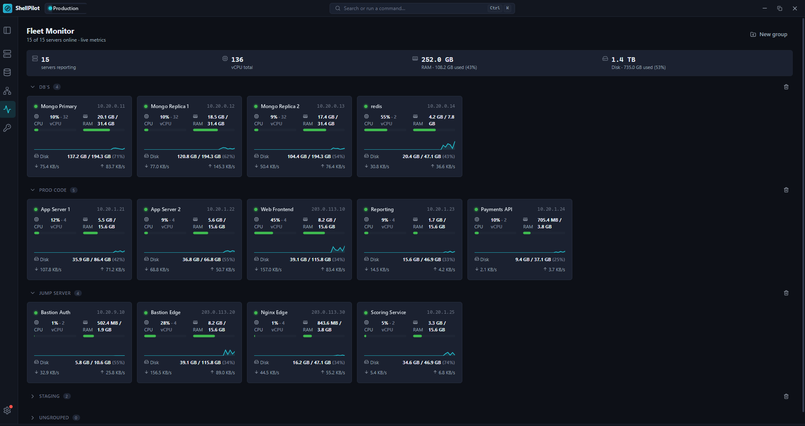

Cards are **grouped**, so databases, application servers and bastions stay visually
separate rather than becoming one long list. Drag a card between groups, or create a
group from the button in the top right; anything unplaced collects in **Ungrouped**, and
groups collapse when you want them out of the way.

The header totals what you actually have: servers reporting, vCPU across the fleet, and
RAM and disk as used-against-capacity. Every figure comes from metrics already being
sampled — for open sessions, and for the whole workspace if **Check servers in the
background** is on — so opening this view adds no extra SSH load. With neither, a server
you have not opened has nothing to show.

## Fleet operations

The same <kbd>Ctrl</kbd>+<kbd>M</kbd> view carries the work that is about the estate rather than
one server: inventory, patching, broadcast, log tailing, search, Docker, Compose, Kubernetes,
database operations, backups, posture, firewall rules, drift, capacity, rules, cron, runbooks,
the change log, access and keys.

Twelve of these are **modules**, in *Settings → Modules*, and all but one ship **off**. Nothing is
collected for a module you have not enabled, and one you never enable costs you nothing — no screen,
no SSH traffic, no rows in the store. That is what "we do not ship bloatware" had to mean in
practice rather than as a claim. The exception is *Scheduled jobs*, which is on by default because
reading a crontab changes nothing; editing one still goes through approval like any other write.

Three rules hold across all of them, and they are the reason this is not just a dashboard:

- **A number nobody measured is not zero.** A server that refused to answer says so, and never
  contributes a zero that quietly drags a fleet average down. The collectors that read server state
  answer in seven words rather than two — *ok*, *partial*, *absent*, *denied*, *no tool*,
  *unsupported*, *unknown* — because "the tool is not installed", "this account may not look" and
  "this server cannot answer at all" are three different facts, and only one of them is worth
  escalating.
- **Anything that writes goes through the same approval a human would need**, and is recorded in
  the change log with who approved it and what it did. A rule that fires a command does not get a
  quieter path than you typing it.
- **Work outlives the window.** A broadcast or a patch wave keeps running on the server if ShellPilot
  is closed, and is picked back up by id when it reopens — reported honestly as *abandoned* or
  *orphaned* when nobody can say how it ended, rather than guessed at.

## Command palette

Press <kbd>Ctrl</kbd>+<kbd>K</kbd> anywhere — including with focus inside a
terminal — to search everything and jump straight to it, without reaching for
the mouse.

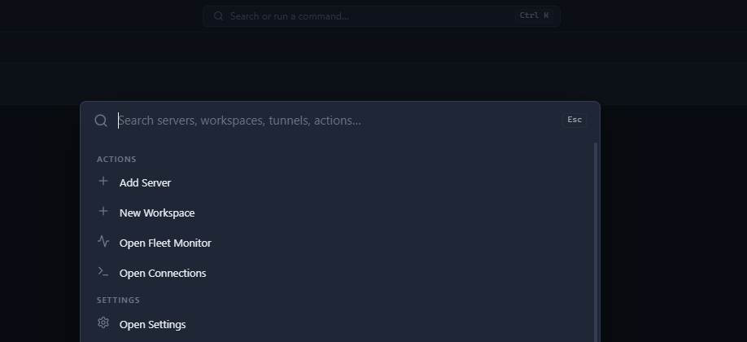

Start typing to filter across **every** category at once, then <kbd>Enter</kbd>
to run the highlighted entry.

| Group | What it does |
|---|---|
| **Actions** | Add Server, New Workspace, Import from `~/.ssh/config`, Open Fleet Monitor, Open Connections |
| **Settings** | Jump straight into Settings |
| **Workspaces** | Switch to any visible workspace by name |
| **Servers** | Open a terminal on any server in the current workspace — matches on name *and* on `user@host` |
| **Tunnels** | Jump to a tunnel, shown with its `listen → target` |

| Key | Action |
|---|---|
| <kbd>Ctrl</kbd>+<kbd>K</kbd> | Open the palette (also <kbd>Ctrl</kbd>+<kbd>Shift</kbd>+<kbd>P</kbd>) |
| <kbd>↑</kbd> / <kbd>↓</kbd> | Move through results |
| <kbd>Enter</kbd> | Run the highlighted entry |
| <kbd>Esc</kbd> | Close |

Because the search also matches the subtitle, typing part of a hostname or a
username finds the server even when you cannot remember what you named it —
`ubuntu@10.20` will find it just as well as `Production API`.

The palette works **while you are in a session**: hit <kbd>Ctrl</kbd>+<kbd>K</kbd>
mid-command, switch workspace or open another server, and the shell you left
keeps running exactly where it was.

## Keyboard shortcuts

On macOS use <kbd>Cmd</kbd> in place of <kbd>Ctrl</kbd>.

Every shortcut below is **rebindable** in Settings → Keyboard Shortcuts, and
each one is listed there with the context it applies to:

| Context | Meaning |
|---|---|
| **Everywhere** | Works with focus anywhere, terminals included |
| **Outside terminals** | Skipped while a terminal has focus, so the key reaches the remote shell |
| **In terminals** | Only fires with focus inside a terminal |

That split is why the palette and the sidebar each have two bindings. A shell
owns <kbd>Ctrl</kbd>+<kbd>K</kbd> (kill-line) and <kbd>Ctrl</kbd>+<kbd>B</kbd>
(backward-char, and the tmux prefix), so those stay out of terminals and a
Shift-qualified twin covers you there instead. The command box in the title bar
follows your focus: it shows <kbd>Ctrl</kbd>+<kbd>K</kbd> normally and
<kbd>Ctrl</kbd>+<kbd>Shift</kbd>+<kbd>P</kbd> once you click into a terminal —
and it shows whatever you have rebound them to.

### General

| Shortcut | Action | Context |
|---|---|---|
| <kbd>Ctrl</kbd>+<kbd>K</kbd> | Command palette — search servers, workspaces, tunnels and actions | Outside terminals |
| <kbd>Ctrl</kbd>+<kbd>Shift</kbd>+<kbd>P</kbd> | Command palette | Everywhere |
| <kbd>Ctrl</kbd>+<kbd>B</kbd> | Show / hide the sidebar | Outside terminals |
| <kbd>Ctrl</kbd>+<kbd>Shift</kbd>+<kbd>B</kbd> | Show / hide the sidebar | Everywhere |
| <kbd>Ctrl</kbd>+<kbd>,</kbd> | Open Settings | Outside terminals |

### Tabs and sessions

| Shortcut | Action | Context |
|---|---|---|
| <kbd>Ctrl</kbd>+<kbd>N</kbd> | Add server | Outside terminals |
| <kbd>Ctrl</kbd>+<kbd>T</kbd> | New terminal on the current server | Outside terminals |
| <kbd>Ctrl</kbd>+<kbd>Shift</kbd>+<kbd>D</kbd> | Duplicate the current tab | Outside terminals |
| <kbd>Ctrl</kbd>+<kbd>W</kbd> | Close the current tab | Outside terminals |
| <kbd>Ctrl</kbd>+<kbd>Tab</kbd> / <kbd>Ctrl</kbd>+<kbd>Shift</kbd>+<kbd>Tab</kbd> | Next / previous tab | Everywhere |
| <kbd>Ctrl</kbd>+<kbd>\</kbd> | Split right | Outside terminals |
| <kbd>Ctrl</kbd>+<kbd>Shift</kbd>+<kbd>\</kbd> | Split down | Outside terminals |
| Double-click a server | Open an additional session in a new tab | |

### Workspaces

| Shortcut | Action | Context |
|---|---|---|
| <kbd>Ctrl</kbd>+<kbd>1</kbd> … <kbd>9</kbd> | Switch to the Nth workspace | Everywhere |
| <kbd>Ctrl</kbd>+<kbd>Shift</kbd>+<kbd>N</kbd> | Manage workspaces | Everywhere |
| <kbd>Ctrl</kbd>+<kbd>L</kbd> | Lock the current workspace (password-protected ones only) | Outside terminals |

<kbd>Ctrl</kbd>+<kbd>1</kbd>…<kbd>9</kbd> is the one binding that cannot be
reassigned — the digit is the workspace number, not a key to map. Whether it
counts hidden workspaces is a setting.

### Views

| Shortcut | Action | Context |
|---|---|---|
| <kbd>Ctrl</kbd>+<kbd>Shift</kbd>+<kbd>E</kbd> | Open the Files view for the current tab | Everywhere |
| <kbd>Ctrl</kbd>+<kbd>M</kbd> | Open the Fleet Monitor | Outside terminals |
| <kbd>Ctrl</kbd>+<kbd>=</kbd> / <kbd>Ctrl</kbd>+<kbd>-</kbd> / <kbd>Ctrl</kbd>+<kbd>0</kbd> | Terminal font bigger / smaller / reset | Everywhere |
| <kbd>Ctrl</kbd>+scroll | Zoom in / out | In terminals |
| <kbd>F12</kbd> | Developer tools | |

### Terminal

| Shortcut | Action | Context |
|---|---|---|
| <kbd>Ctrl</kbd>+<kbd>Shift</kbd>+<kbd>C</kbd> or <kbd>Ctrl</kbd>+<kbd>Insert</kbd> | Copy selection | In terminals |
| <kbd>Ctrl</kbd>+<kbd>Shift</kbd>+<kbd>V</kbd> or <kbd>Shift</kbd>+<kbd>Insert</kbd> | Paste | In terminals |
| <kbd>Ctrl</kbd>+<kbd>Shift</kbd>+<kbd>F</kbd> or <kbd>Ctrl</kbd>+<kbd>F</kbd> | Search the scrollback | In terminals |
| <kbd>Enter</kbd> / <kbd>Shift</kbd>+<kbd>Enter</kbd> | Next / previous match while searching | |
| Right-click | Paste (PuTTY / MobaXterm style) | In terminals |
| Select text | Copies automatically | In terminals |

Text selection copies on release, and pasting more than one line asks for
confirmation first.

### Customising shortcuts

Settings → Keyboard Shortcuts.

- **Rebind** — click a shortcut and press the keys you want. The combo is
  recorded exactly as pressed.
- **Clear** — press <kbd>Backspace</kbd> while recording to leave a command with
  no key at all. <kbd>Esc</kbd> cancels without changing anything.
- **Restore one** — a ↺ button appears next to any shortcut you have changed.
- **Reset all** — the Reset button puts every shortcut back to its default.
- **Conflicts** — two commands sharing a combo are flagged, but only when their
  contexts actually overlap. A terminal binding and an outside-terminal binding
  can safely share keys, because they never see the same key press.
- **Export / Import** — writes a small `shellpilot-shortcuts.json` holding only
  the shortcuts you changed, so it stays valid across upgrades. Importing
  replaces your current overrides.

Changes take effect immediately and are saved with the rest of your settings, so
they survive a restart.

### Deliberately not bound

| Key | Why |
|---|---|
| <kbd>Ctrl</kbd>+<kbd>R</kbd> | Reserved for the shell's reverse history search. ShellPilot never reloads on it — a reload would destroy every open session. |
| <kbd>Ctrl</kbd>+<kbd>C</kbd>, <kbd>Ctrl</kbd>+<kbd>A</kbd>, <kbd>Ctrl</kbd>+<kbd>E</kbd>, <kbd>Ctrl</kbd>+<kbd>O</kbd> | Passed to the remote shell so `vim`, `nano` and bash line editing behave normally. |
| <kbd>F5</kbd> | Blocked — it would reload the window and close every terminal. |

Nothing stops you binding one of these yourself, but scoping it to
**Everywhere** will take it away from the remote shell.

## Databases

ShellPilot speaks **PostgreSQL, MySQL, SQL Server, MongoDB and Redis**. Add a connection with discrete fields or a full connection string, browse tables and collections in the sidebar, and open each database in its own tab.

Every engine gets an **interactive shell** alongside the query editor:

- **MongoDB** — `show dbs`, `use x`, `db.users.find({...}).sort({...}).limit(n)`, aggregation pipelines, `ObjectId()` / `ISODate()` helpers
- **PostgreSQL / MySQL / SQL Server** — SQL plus psql-style meta commands: `\l`, `\dt`, `\d <table>`, `\du`, `\c <database>`
- **Redis** — commands passed straight through

**Databases over SSH:** pick a bastion in the *SSH tunnel* field and ShellPilot opens a forward automatically, so you can reach a database that is only routable from inside the network.

**Databases over a VPN:** pick a WireGuard or OpenVPN profile in the *Network* field and the tunnel is brought up before the connection is attempted. A bastion and a VPN can both be set — the VPN is the outer transport, and the bastion is reached through it.

**Operating a database, not just querying it.** Beside the client there is a read of how the server itself is doing: replication lag, slow queries, table and index sizes, connection counts against the ceiling, and the locks and long transactions behind them. It covers **PostgreSQL, MySQL/MariaDB, MongoDB and Redis**; SQL Server has the client but not this, and the app says so rather than showing an empty panel.

A replica reporting zero lag is not the same as a replica that is healthy — a stopped one says zero too — so the read distinguishes "caught up" from "not replicating", which is the distinction a real dead replica taught it to make.

## SSH tunnels

Create local forwards, remote forwards or a SOCKS5 proxy over any saved server. Live connection counts are shown per tunnel, and a dropped SSH connection tears the listener down rather than leaving it accepting traffic that goes nowhere.

## VPN and reverse-proxy tunnels

ShellPilot speaks **WireGuard**, **OpenVPN** and **frp**. Full guide: **[docs/VPN.md](docs/VPN.md)**.

The default is the unusual part: **WireGuard runs entirely in userspace and needs no administrator rights.** There is no network interface, your routing table and DNS are untouched, and if ShellPilot is killed there is nothing to clean up. The tunnel appears instead as local listeners — a SOCKS5 proxy on `127.0.0.1`, and any forwards you define — and you point individual connections at it.

That trade is deliberate. Reaching one bastion, one database or one internal service does not need your whole machine on the far network. When it genuinely does, system mode is one toggle away on Linux and Windows and asks for elevation each time you connect — with two stated limits: a full tunnel (`0.0.0.0/0`) is refused, and macOS is blocked for want of an Apple Developer ID. [docs/VPN.md](docs/VPN.md) explains both. Neither affects the default.

- **Handshake age, not just a green dot.** A WireGuard tunnel whose process is up but whose handshake has gone stale is shown as **degraded** in amber, not connected in green. Up-but-not-passing-traffic and down are different problems, and almost no client distinguishes them.
- **SSH and databases over a VPN.** Pick a profile on a server or a database and it is started, waited for, and torn down with the session. If it cannot come up you see *the VPN's* error, not a connect timeout twenty seconds later.
- **Imported configs are treated as hostile.** A `.ovpn` file can run programs — `up`, `plugin`, `script-security` and friends execute before the server is ever contacted. ShellPilot never hands your file to OpenVPN: it parses it, rejects anything that runs a program (quoting the line back to you), and generates a fresh config from what is left. `PostUp`/`PostDown` in a WireGuard `.conf` are refused the same way.
- **Split tunnelling by default.** `redirect-gateway` is off unless you turn it on, even when the profile asks for it. Downloading a profile should not silently reroute your machine.
- **frp states what it exposes, in words.** Each proxy carries a confirmation reading *"Make 127.0.0.1:5432 reachable from frp.example.com."* and the profile will not start until every one is ticked.
- **An AI agent can never start an frp profile**, and starting any VPN always asks for approval — even for an access group that allows it.

**Every tunnel engine is bundled, and one of them is not open source.** WireGuard (via the MIT `wireguard-go`), frp (Apache-2.0) and OpenVPN (GPL-2.0, macOS and Linux) are all built from pinned upstream source at release time — nothing to install, and each binary hash-verified before it runs. OpenVPN needs an adapter driver on Windows that cannot be shipped as a file, so a Windows OpenVPN profile still uses an OpenVPN you installed. Windows also ships `wintun.dll`, which is **proprietary** — the single component in ShellPilot that is not open source, needed only by WireGuard system mode. Bundling GPL software obliges this project to publish the matching source, and every release carries OpenVPN's as an asset. All of it is set out in [THIRD-PARTY-NOTICES.md](THIRD-PARTY-NOTICES.md).

**There is no kill switch.** ShellPilot tears down what it started when a tunnel drops, and says so — it does not install firewall rules, and does not claim to.

## Vault

An encrypted store for the credentials that do not belong to a single server — cloud logins, API keys, database URLs, licence keys.

- **AES-256-GCM**, with the key derived from your master password using **scrypt**
- The master password is **never stored**; a wrong one fails the authentication tag
- Entries hold a URL, username, password, notes, tags and **any number of custom key/value fields**, each markable secret
- **Search matches every field**, so you can find an entry by hostname or username, not just its title
- Plaintext exists only in memory while unlocked, and is wiped on lock and on quit

> There is **no recovery** if the master password is lost. That is the point.

## Backup & restore

Settings → **Backup & Restore** exports everything — workspaces, servers, databases, tunnels, stored credentials, the vault, workspace passwords and trusted host keys — into a **single passphrase-encrypted file**.

Credentials on disk are sealed with your OS keychain, which is tied to that machine and user, so a copied config folder is useless elsewhere. The backup unseals them and re-encrypts everything under your passphrase, which makes it **portable to any machine**.

A red **Backup out of date** indicator appears whenever your connections change, so you know when the last export no longer reflects reality.

## Settings

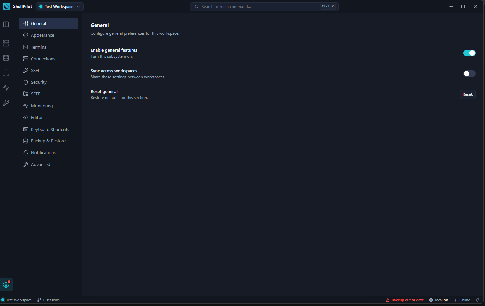

| Section | What it covers |
|---|---|
| **General** | Workspace-level preferences |
| **Appearance** | Theme (dark / light / system) and density |
| **Terminal** | Font family, **font size** (also <kbd>Ctrl</kbd>+<kbd>+</kbd>/<kbd>-</kbd>), cursor blink, scroll behaviour |
| **Connections** | Defaults for new connections |
| **SSH** | **How long an authenticated connection is kept** after its last session closes, and a live list of shared connections with a Disconnect button |
| **Security** | Credential storage, workspace locking, and the list of **trusted SSH host keys** with a Forget button |
| **SFTP** | File transfer preferences |
| **Monitoring** | **Alerts** (on by default — the master switch for CPU, memory, failed units and webhooks), the threshold, **checking servers in the background** and how often, **webhook delivery**, and the monitor strip |
| **Editor** | Built-in file editor |
| **Keyboard Shortcuts** | **Rebind any shortcut**, clear it, reset to defaults, export/import, and whether <kbd>Ctrl</kbd>+<kbd>1</kbd>…<kbd>9</kbd> includes hidden workspaces |
| **Backup & Restore** | Encrypted export and import |
| **Notifications** | Alerts and toasts |
| **Advanced** | Diagnostics and resets |

The **SSH → Keep authenticated connection** setting is the one to know if your servers use two-factor auth: while a connection is alive, new sessions, file browsing and monitoring all reuse it, so you are asked for a code once rather than every time.

## Security

- Credentials are stored with **Electron `safeStorage`**, backed by DPAPI on Windows, Keychain on macOS and libsecret on Linux — never in plaintext
- The vault and backups use **AES-256-GCM** with **scrypt** key derivation
- Workspace passwords are stored as **scrypt verifiers** compared in constant time
- **Host keys are verified**: unknown servers prompt with a SHA-256 fingerprint, and a changed key is refused outright
- Shell input is **parsed, never evaluated** — no `eval` on anything you type
- The renderer runs with `contextIsolation` on and `nodeIntegration` off, behind a strict Content-Security-Policy

Found a vulnerability? Please read [SECURITY.md](SECURITY.md) — do not open a public issue.

## FAQ

### What is ShellPilot?

ShellPilot is a free, open-source, cross-platform desktop application that combines an SSH
terminal, an SFTP file browser, an SSH tunnel manager, a multi-engine database client, an
encrypted secrets vault and a secure MCP bridge for AI coding agents (Claude Code, Claude
Desktop, Codex and others) in a single window. It runs on Windows, macOS and Linux, is released
under the MIT licence, and needs no account.

### Which file should I download?

On Windows, `ShellPilot-x.y.z-setup.exe` unless you specifically want the
portable single-file build. On macOS, `-arm64.dmg` for an M1 or later and
`-x64.dmg` for an Intel Mac. On Linux, the `.AppImage` works on any
distribution, and the `.deb` is there if you would rather install through
`apt` on Debian or Ubuntu. The `.blockmap` and `latest*.yml` files on the
release page are build metadata — you never need to download them.

### Is ShellPilot really free?

Yes. It is MIT licensed, free for personal and commercial use, with no paid tier, no
session limit and no subscription. Nobody should be charging you for it.

### Is ShellPilot a good MobaXterm alternative?

It is the closest free alternative for most workflows, and unlike MobaXterm it runs on macOS
and Linux as well as Windows. There is no 12-session cap, no Professional Edition, and the
built-in database client and vault cover work MobaXterm sends you elsewhere for. MobaXterm's
X11 server and its bundled Cygwin toolchain have no equivalent here.

### Can it replace PuTTY?

For day-to-day SSH, yes — with saved sessions, folders, tabs, a searchable scrollback and
right-click paste in the PuTTY style. It also imports the servers you already have in
`~/.ssh/config`, so there is no re-typing. Serial-port connections are not supported.

### Is it an open-source Termius alternative?

Yes. The functional difference is sync: Termius syncs your servers through its cloud on a
paid plan, while ShellPilot keeps everything local and moves it between machines with a
passphrase-encrypted backup file. Nothing is uploaded and nothing phones home.

### Does ShellPilot support jump hosts and bastions?

Yes — unlimited chained hops per server, configured in the same dialog as the server itself.
Each hop can either reuse a saved server's credentials or define its own server, port, user and
key. `ProxyJump` entries in `~/.ssh/config` are imported as jump hosts automatically.

### Which databases does it support?

PostgreSQL, MySQL, SQL Server, MongoDB and Redis — each with a table/collection browser, a
query editor and an interactive shell. Any of them can be reached through an SSH tunnel, so a
database that is only routable from inside the network still works.

### How are my passwords and SSH keys stored?

In your operating system's own credential store through Electron `safeStorage` — DPAPI on
Windows, Keychain on macOS, libsecret on Linux. Nothing is written in plaintext. The vault
and encrypted backups add AES-256-GCM with scrypt key derivation on top of that.

### Does ShellPilot send any data anywhere?

No. There is no account, no telemetry, no analytics and no update ping. Every connection it
makes is one you configured.

### Does it work offline?

Yes, entirely. The app has no online dependency beyond the servers you connect to.

### Does it support two-factor authentication?

Yes. It answers keyboard-interactive challenges, and connections are shared between sessions,
file browsing and monitoring — so you enter a code once rather than once per tab.

### Why does Windows SmartScreen or macOS Gatekeeper warn about it?

Because ShellPilot is not notarized, and on Windows not signed at all. Both systems expect
an application to carry a code-signing certificate, which costs roughly $200–$400 a year for
Windows and $99 a year for an Apple Developer account — money a free, MIT-licensed project
with no income does not have. The warning means the operating system cannot confirm **who**
published the app, not that the file is unsafe. On Windows choose *More info → Run anyway*;
on macOS use **System Settings → Privacy & Security → Open Anyway** (or right-click →
**Open** on macOS 14 and earlier). Releases up to 0.2.2 can show *"ShellPilot is damaged and
can't be opened"* instead, which has no button to click through — run
`/usr/bin/xattr -cr /Applications/ShellPilot.app` for those, not the Trash the dialog
suggests. Full instructions are under
[First run: why your computer shows a warning](#first-run-why-your-computer-shows-a-warning),
and every release publishes SHA-256 checksums so you can verify the download yourself.

### What are the system requirements?

Windows 10 or later, macOS 11 or later (Apple Silicon and Intel), or a modern 64-bit Linux
distribution. Building from source needs Node.js 20 or later.

### Can I connect Claude Code, Claude Desktop or another AI agent to ShellPilot?

Yes — see [AI Agent Access](#ai-agent-access). ShellPilot runs a local
[MCP](https://modelcontextprotocol.io) server that Claude Code, Claude Desktop, Codex, Gemini CLI
and other MCP-compatible clients can connect to, each session scoped to the workspace(s) and
access group chosen for it. The agent never sees a password, private key, database credential or
Vault secret — it only ever gets a friendly server name and whatever that session's access group
allows.

### Is it safe to let an AI agent run commands on my servers?

It's as safe as the access group you assign it, and that's a real limitation, not a slogan — see
[docs/AI-SECURITY.md](docs/AI-SECURITY.md) for what this design does and does not protect against.
What ShellPilot does provide: the bridge only listens on `127.0.0.1`, every capability (run
commands, read/write files, SFTP, tunnels, database access, sudo, metrics) is independently
ALLOW/ASK/DENY, sudo/unrestricted shells are hard-blocked regardless of group, and anything marked
ASK stops and waits for you to approve or deny it in ShellPilot — an agent can never approve its
own request. Every action is logged in the Audit Log with secrets redacted.

### How do I move my setup to another machine?

Settings → Backup & Restore writes a single passphrase-encrypted file containing workspaces,
servers, databases, tunnels, credentials, the vault and trusted host keys. Restore it on the
new machine with the same passphrase.

### How can I help?

Star the repository, report bugs, or open a pull request — see [Contributing](#contributing).

## Contributing

Contributions are very welcome, whether that is code, documentation, a bug report or a translation. Start with [CONTRIBUTING.md](CONTRIBUTING.md) for the architecture overview and development workflow, and please follow our [Code of Conduct](CODE_OF_CONDUCT.md).

Good first issues are labelled [`good first issue`](https://github.com/ghauri01/ShellPilot/labels/good%20first%20issue).

## Licence

ShellPilot is released under the **[MIT Licence](LICENSE)** — free to use, copy, modify and share, for personal and commercial work alike, with no fee and no subscription.

**This tool is not sold.** It is given to the community. If someone is charging you for ShellPilot itself, you are being overcharged — download it here for free. The MIT licence does permit others to redistribute or build commercial products on top of it; that is a deliberate part of being genuinely open source, and it is what lets companies adopt it without a legal review.

Please do keep the copyright notice, and do not imply the maintainers endorse a fork.

---

<div align="center">

**Built for the DevOps community.** If ShellPilot saves you time, a ⭐ helps others find it.

[⬇ Download ShellPilot](https://github.com/ghauri01/ShellPilot/releases/latest) · [🐞 Report a bug](https://github.com/ghauri01/ShellPilot/issues/new/choose) · [📧 Contact](mailto:aliwaqarofficial@gmail.com)

*Keywords: open source SSH client, free SSH client for Windows, free MobaXterm alternative, PuTTY alternative, Termius alternative, SecureCRT alternative, Xshell alternative, MobaXterm for Mac, SSH client for macOS, SSH client for Linux, SSH terminal manager, SSH connection manager, SFTP client, SCP file transfer, SSH tunnel manager, port forwarding tool, SOCKS5 proxy client, bastion host client, jump host SSH client, ProxyJump GUI, ssh config importer, server monitoring tool, database GUI client, PostgreSQL client, MySQL client, MongoDB client, Redis client, SQL Server client, database over SSH tunnel, password manager for developers, encrypted secrets vault, AES-256-GCM vault, DevOps tools, sysadmin tools, self-hosted, no telemetry, no subscription, Electron SSH client, cross-platform terminal, Windows macOS Linux, MCP server, Model Context Protocol, AI agent SSH access, Claude Code MCP integration, Claude Desktop MCP server, Codex MCP server, Gemini CLI MCP, AI DevOps tool, secure AI infrastructure access, AI agent access control, credential-free AI automation, human-in-the-loop AI approvals, AI audit log.*

</div>
